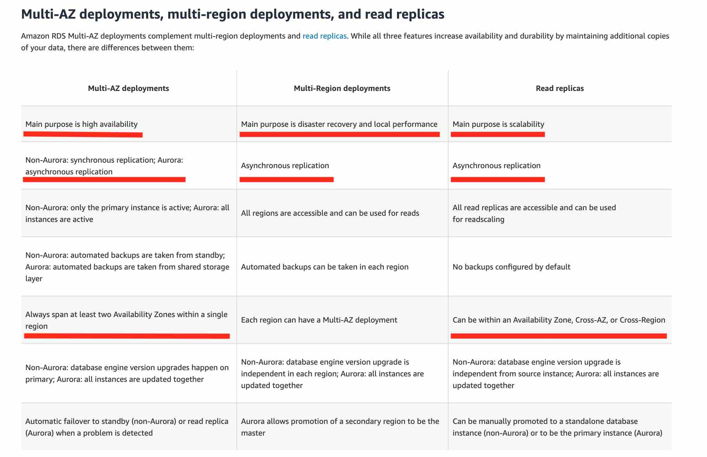

# Quick Recap

- Amazon FSx for windows file server supports microsoft DFS
- FSx for Lustre does not support Microsoft DFS
-  IAM users or AWS services can assume IAM Roles
- AWS Lambda currently supports 1000 (soft limit)concurrent executions per AWS account per region.
- Amazon GuardDuty offers threat detection that enables you to continuously monitor and protect your AWS accounts, workloads, and data stored in Amazon S3. (Disabling the service will delete all data)
---
- FileGateway - NFS/SMB
- VolumeGateway - iSCSI
- FSx for Windows File Server - SMB
---
- Use AWS WAF to block or allow requests based on conditions that you specify, such as the IP addresses. You can also use AWS WAF preconfigured protections to block common attacks like SQL injection or cross-site scripting.
- In S3, when your object size reaches 100 MB, you should consider using multipart uploads
- If your organization has multiple AWS accounts, then you can subscribe multiple AWS Accounts to AWS Shield Advanced by individually enabling it on each account using the AWS Management Console or API
- Firehose cannot directly write into a DynamoDB table
- FIFO queues support up to 300 messages per second (300 send, receive, or delete operations per second). When you batch 10 messages per operation (maximum), FIFO queues can support up to 3,000 messages per second.
---
- To prevent your API from being overwhelmed by too many requests, Amazon API Gateway throttles requests to your API using the token bucket algorithm, where a token counts for a request.
- Elastic Load Balancer cannot throttle requests

---

{ loading=lazy}

- Multi-AZ follows synchronous replication and spans at least two Availability Zones (AZs) within a single region. Read replicas follow asynchronous replication and can be within an Availability Zone (AZ), Cross-AZ, or Cross-Region

- Use permissions boundary to control the maximum permissions employees can grant to the IAM principals
- Amazon ElastiCache Memcached cannot be used as a cache to serve static content from Amazon S3

---

- Geolocation routing lets you choose the resources that serve your traffic based on the geographic location of your users, meaning the location that DNS queries originate from.

- You can use georestriction, also known as geo-blocking, to prevent users in specific geographic locations from accessing content that you're distributing through a Amazon CloudFront web distribution

- Amazon **API Gateway** creates RESTful APIs that: Are HTTP-based & Enable **stateless** client-server communication.

- Amazon **API Gateway** creates WebSocket APIs that: Adhere to the WebSocket protocol, which enables **stateful**, full-duplex communication between client and server. Route incoming messages based on message content.

---

- You can place a retention period on an object version either explicitly or through a bucket default setting. When you apply a retention period to an object version explicitly, you specify a Retain Until Date for the object version.

- Different versions of a single object can have different retention modes and periods

---
- Amazon Aurora Global Database is designed for globally distributed applications, allowing a single Amazon Aurora database to span multiple AWS regions.

- Amazon S3 Transfer Acceleration (Amazon S3TA) enables fast, easy, and secure transfers of files over long distances between your client and an S3 bucket. Transfer Acceleration takes advantage of Amazon CloudFront’s globally distributed edge locations. As the data arrives at an edge location, data is routed to Amazon S3 over an optimized network path.

- Using S3, application can achieve at least 3,500 PUT/COPY/POST/DELETE or 5,500 GET/HEAD requests per second **per prefix** in a bucket.

-  SSE-KMS provides you with an audit trail that shows when your CMK was used and by whom.

- AWS CloudTrail log data can be ingested into Amazon CloudWatch to monitor and identify your AWS account activity against security threats, and create a governance framework for security best practices

- AWS CloudTrail integrates with the Amazon CloudWatch service to publish the API calls being made to resources or services in the AWS account.

-  AWS CloudTrail cannot stream data to Amazon Kinesis. Amazon S3 buckets and Amazon CloudWatch logs are the only destinations possible.

---

- You can put an instance that is in the InService state into the Standby state, update some software or troubleshoot the instance, and then return the instance to service. Instances that are on standby are still part of the Auto Scaling group, but they do not actively handle application traffic.

- The ReplaceUnhealthy process terminates instances that are marked as unhealthy and then creates new instances to replace them. Amazon EC2 Auto Scaling stops replacing instances that are marked as unhealthy. Instances that fail EC2 or Elastic Load Balancing health checks are still marked as unhealthy. As soon as you resume the ReplaceUnhealthly process, Amazon EC2 Auto Scaling replaces instances that were marked unhealthy while this process was suspended.

- There are no S3 data transfer charges when data is transferred in from the internet. Also with S3TA, you pay only for transfers that are accelerated.

---

- For Amazon Aurora, each Read Replica is associated with a priority tier (0-15). In the event of a failover, Amazon Aurora will promote the Read Replica that has the highest priority (the lowest numbered tier). If two or more Aurora Replicas share the same priority, then Amazon RDS promotes the replica that is largest in size. If two or more Aurora Replicas share the same priority and size, then Amazon Aurora promotes an arbitrary replica in the same promotion tier.

- FSx for Lustre provides the ability to both process the 'hot data' in a parallel and distributed fashion as well as easily store the 'cold data' on Amazon S3.

- Unsupported life cycle transitions for S3 storage classes - Any storage class to the Amazon S3 Standard storage class. Any storage class to the Reduced Redundancy storage class. The Amazon S3 Intelligent-Tiering storage class to the Amazon S3 Standard-IA storage class. The Amazon S3 One Zone-IA storage class to the Amazon S3 Standard-IA or Amazon S3 Intelligent-Tiering storage classes.

---

- AWS Storage Gateway's file interface, or file gateway, offers you a seamless way to connect to the cloud in order to store application data files and backup images as durable objects on Amazon S3 cloud storage. File gateway offers SMB or NFS-based access to data in Amazon S3 with local caching.

- You can configure the AWS Storage Gateway service as a Volume Gateway to present cloud-based iSCSI block storage volumes to your on-premises applications. Volume Gateway does not support NFS interface, so this option is not correct.

- Tape Gateway allows moving tape backups to the cloud. Tape Gateway does not support NFS interface, so this option is not correct.

- Direct Connect involves significant monetary investment and takes at least a month to set up

---

- Amazon GuardDuty analyzes tens of billions of events across multiple AWS data sources, such as AWS CloudTrail events, Amazon VPC Flow Logs, and DNS logs.

- The minimum storage duration is 30 days before you can transition objects from Amazon S3 Standard to Amazon S3 One Zone-IA.

- Amazon Kinesis Data Firehose is the easiest way to load streaming data into data stores and analytics tools. It can capture, transform, and load streaming data into Amazon S3, Amazon Redshift, Amazon OpenSearch Service, and Splunk, enabling near real-time analytics with existing business intelligence tools and dashboards you’re already using today.

- Kinesis Data Streams cannot directly write the output to Amazon S3. Unlike Amazon Kinesis Data Firehose, KDS does not offer a ready-made integration via an intermediary AWS Lambda function to reliably dump data into Amazon S3.